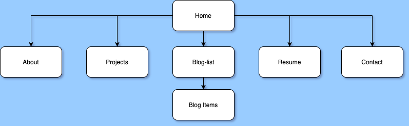
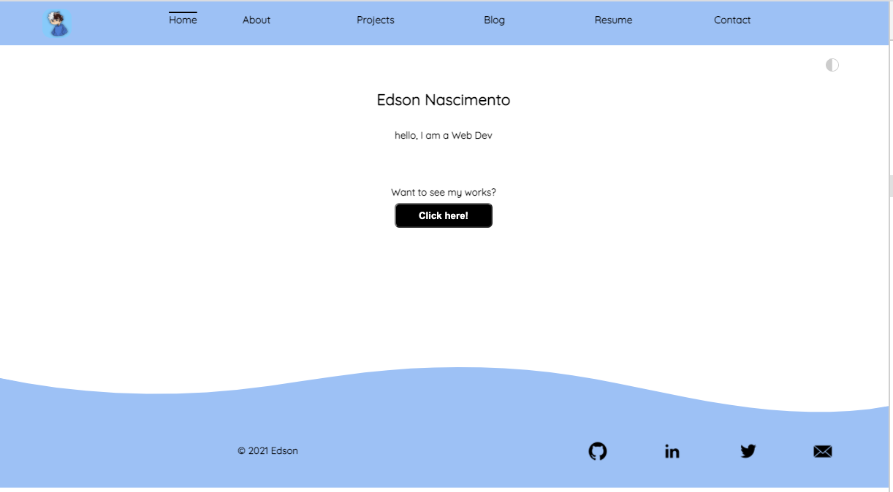
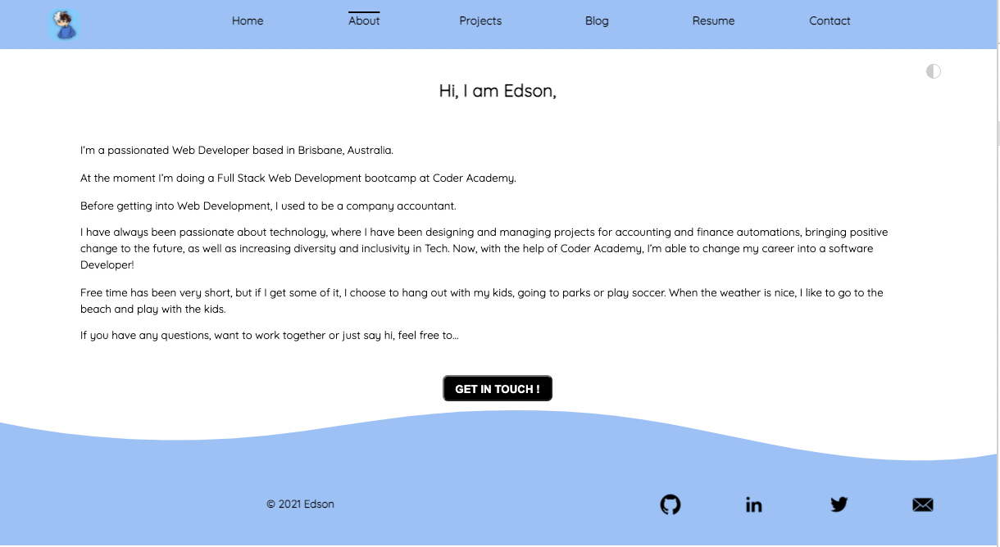
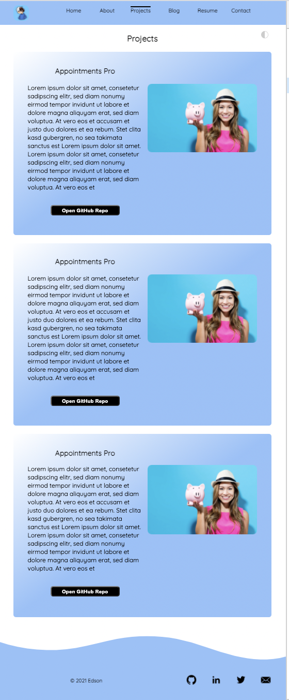
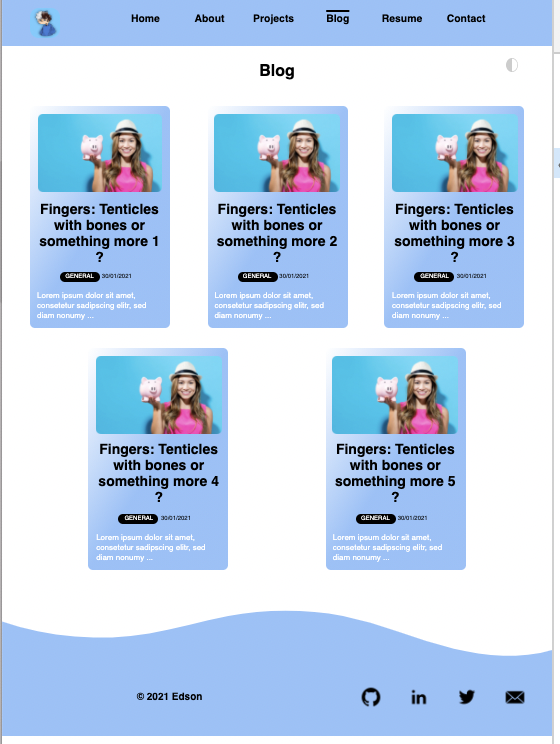
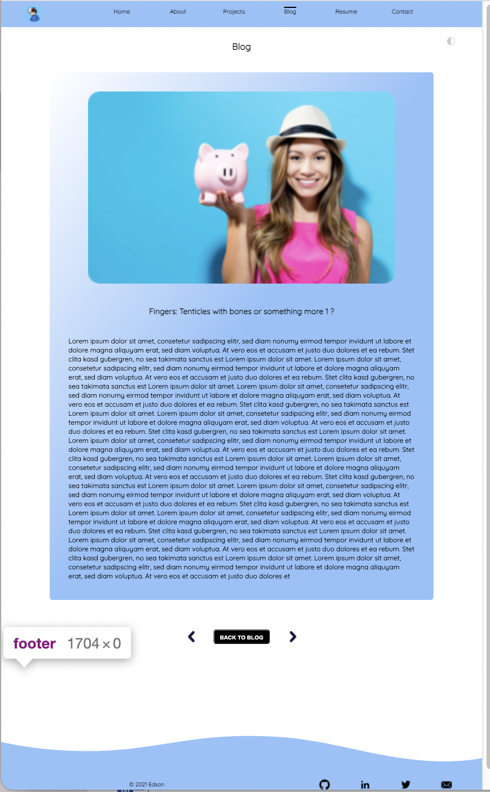
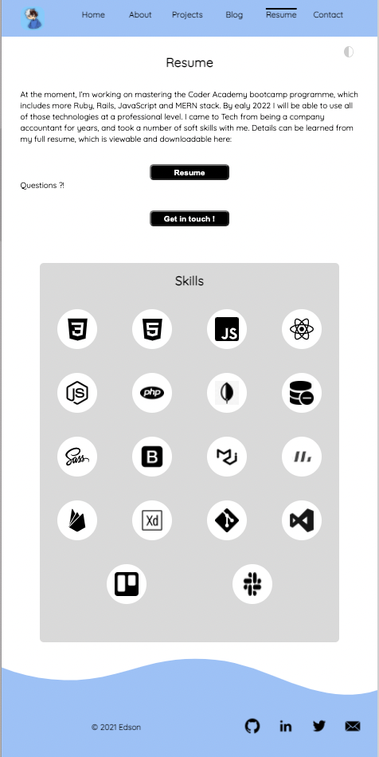
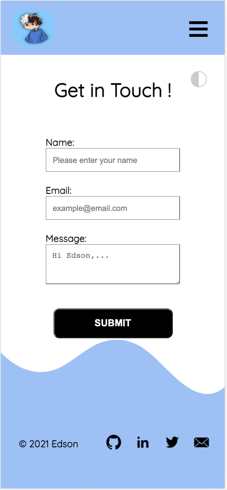

# Portfolio Website

### Portfolio Website Link [Portfolio Website](https://edson-portfolio.netlify.app/)

### Github Repo Link [Github Repo](https://github.com/Kryptic2020/Portfolio2)

### Description:

-   **The purpose** of this Portfolio Website is to show my accomplishments, experiences, skills, and attributes. Also to highlights and showcases samples of some of my best work, along with life experiences, values and achievements.

-   **Funtionality and features:** Links to my social network and resume, contact form, easy and animated navigation bar to facilitate accessing all the website content,side bar for mobile viewport size, animated skills icons and ease arrow navigation to navigate between blogs.

-   **SiteMap:**
    

-   **Screen shoots:**
    
    
    
    
    
    
    

-   **Target audience:** IT industry, Companies, Small business and individual who needs a website.

-   **Tech stack:** CSS, HTML, SASS, TYPEJS, GIT AND NETLIFY.
